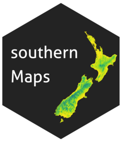
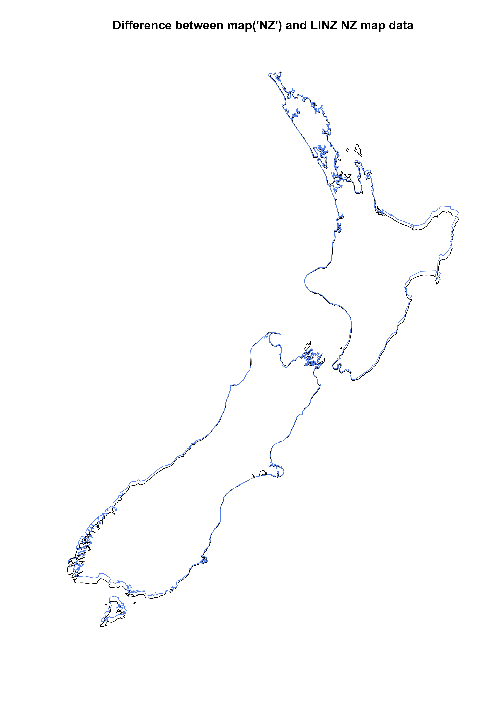

# southernMaps 

[](https://zenodo.org/badge/latestdoi/94381659)

Package of maps (for NZ) and assorted functions. Why? The map('nzHires') doesn't work with all WGS84 point data (you can end up in the ocean for surprisingly terrestrial points), and when you convert the LINZ map of NZ in WGS84, they don't line up:



The data include the following maps as SpatialPolygonsDataFrames:

1. nzHigh (high res), nzMed, nzSml (low res) in NZTM
2. nzHigh84, nzMed84, nzSml84 as above, but in WGS84.

install as follows (you'll need devtools installed (`install.packages('devtools')`))

```{r}
# devtools::install_github("orb16/southernMaps")
# update
# to get the vignette to build, use the code below
devtools::install_github("orb16/southernMaps", build_opts = c("--no-resave-data", "--no-manual"))
require(southernMaps)
```

**new:** now with vignette! After loading the package run `vignette("southernMaps-Vignette")` in R to read it! Read on for some basic examples too. 

examples:

```{r}

# whole country 

par(mfrow = c(1, 3))
plot(nzHigh, main = "nzHigh", border = "red2")
plot(nzMed, main = "nzMed", col = "orange")
plot(nzSml, main = "nzSml")
par(mfrow = c(1, 1))

# Stewart Island - shows difference in resolution 

par(mfrow = c(1, 3))
plot(nzHigh[nzHigh@data$name == "Stewart Island/Rakiura", ], main = "nzHigh: Stewart Island")
plot(nzMed[nzMed@data$name == "Stewart Island/Rakiura", ], main = "nzMed: Stewart Island")
plot(nzSml[nzSml@data$name == "Stewart Island/Rakiura", ], main = "nzSml: Stewart Island")
par(mfrow = c(1, 1))

# get CRS for NZTM

find_CRS(search = "New Zealand") 
# gives 2 options, select NZTM. CRS code is in the "code" column
find_CRS(epsg = "2193")

# get high res version of small islands:

isle <- find_my_island("chatham", "wgs84")
plot(isle)

# or in NZTM:

isle <- find_my_island("chatham", "nztm")
plot(isle)

```
